# CipherWatch — AI Crime Intelligence & Threat Analytics for Karnataka State Police

CipherWatch is an interactive crime-intelligence and analytical decision-support
dashboard built with Python and Streamlit. It combines historical incident
exploration, temporal and geographic analysis, density-based hotspot detection,
time-location risk classification, crime-count estimation, and transparent model
evaluation in a responsive dark cybersecurity interface.

> [!IMPORTANT]
> The current repository uses **demonstration crime data derived from a City of
> Los Angeles Open Data sample**. It is not connected to live Karnataka State
> Police systems, operational databases, dispatch systems, or official APIs.
> Karnataka State Police branding describes the intended project context; it
> does not change the source or jurisdiction of the bundled demonstration data.

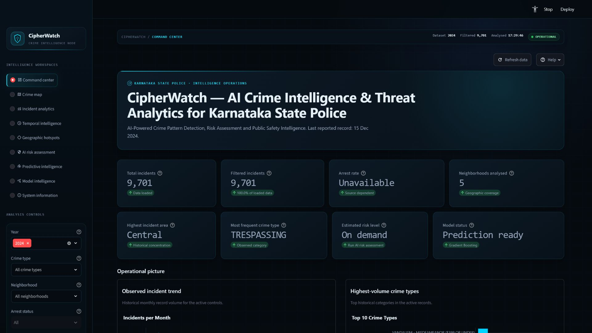

## Table of contents

- [Project overview](#project-overview)
- [Problem statement](#problem-statement)
- [Objectives](#objectives)
- [Core features](#core-features)
- [System architecture](#system-architecture)
- [Complete project workflow](#complete-project-workflow)
- [Data loading, filtering, and processing](#data-loading-filtering-and-processing)
- [Analytical concepts and boundaries](#analytical-concepts-and-boundaries)
- [Maps, heatmaps, and analytical graphs](#maps-heatmaps-and-analytical-graphs)
- [Hotspot detection](#hotspot-detection)
- [Risk classification](#risk-classification)
- [Crime-count prediction](#crime-count-prediction)
- [Technology stack](#technology-stack)
- [Machine-learning algorithms](#machine-learning-algorithms)
- [Model inputs and outputs](#model-inputs-and-outputs)
- [Evaluation metrics](#evaluation-metrics)
- [Current demonstration results](#current-demonstration-results)
- [Dataset information](#dataset-information)
- [Dashboard workspaces](#dashboard-workspaces)
- [Project structure](#project-structure)
- [Installation and run instructions](#installation-and-run-instructions)
- [Testing and validation](#testing-and-validation)
- [Performance and accessibility](#performance-and-accessibility)
- [Limitations](#limitations)
- [Responsible AI notice](#responsible-ai-notice)
- [Future enhancements](#future-enhancements)
- [Screenshots](#screenshots)

## Project overview

CipherWatch converts a processed incident dataset into an interface suitable for
learning, demonstrations, interviews, technical evaluation, and exploratory
analysis. Users can:

- Filter historical records by year, crime category, and neighborhood.
- Explore interactive Folium maps and geographic density surfaces.
- Inspect daily, hourly, weekday, monthly, neighborhood, and category patterns.
- Detect historical coordinate concentrations with DBSCAN.
- Run an existing Gradient Boosting classifier for grouped time-location risk.
- Run an existing Gradient Boosting regressor for grouped incident counts.
- Review held-out metrics, confusion matrices, residuals, feature importance,
  and feature correlation.
- Export the currently filtered historical records.

The frontend deliberately distinguishes source records from transformations and
model-generated outputs. It does not present a density surface, cluster, risk
class, or predicted count as a guaranteed future event.

## Problem statement

Historical crime datasets contain temporal, categorical, and geographic signals,
but raw rows are difficult to interpret quickly. Analysts and students need a
single interface that can answer questions such as:

- When were incidents most frequently recorded?
- Which crime categories dominate the active selection?
- How do represented neighborhoods compare?
- Where do historical coordinates form dense spatial groups?
- How does an existing model classify grouped time-location scenarios?
- How closely do predicted grouped counts match held-out observed counts?
- Which model inputs influence the current estimators?
- What limitations should accompany every analytical result?

CipherWatch addresses that need through transparent exploratory analytics and
model evaluation. It is a decision-support and educational system, not an
autonomous enforcement system.

## Objectives

1. Present historical incident data in a clear, responsive command-center UI.
2. Support reproducible filtering without modifying the underlying dataset.
3. Reveal temporal, geographic, categorical, and neighborhood-level patterns.
4. Detect density-based historical coordinate clusters with the existing DBSCAN
   implementation.
5. Expose the existing risk-classification and count-regression workflows through
   explicit user actions.
6. Keep observed values, engineered features, and model outputs clearly labeled.
7. Report model quality honestly through held-out evaluation metrics.
8. Provide Responsible AI guidance and human-review requirements.
9. Preserve modular separation between data, machine learning, visualization,
   presentation, and configuration code.

## Core features

### Historical analytics

- Global form-batched filters
- Monthly and daily crime trends
- Seven-day moving average
- Hourly and weekday distributions
- Neighborhood comparison
- Crime-category distribution
- Neighborhood-by-category matrix
- Searchable filtered incident register
- Filtered CSV export

### Geographic intelligence

- Dark interactive Folium base map
- Historical point-density heatmap
- Marker-cluster display
- Combined density and incident modes
- Interactive longitude-latitude density matrix
- DBSCAN historical hotspot centers
- Cluster-volume profile and cluster register

### Machine-learning intelligence

- Gradient Boosting time-location risk classification
- Gradient Boosting grouped crime-count regression
- Scenario-based AI risk assessment
- Model-generated temporal risk matrix
- Risk-level distribution comparison
- Observed-versus-predicted scatter plot
- Held-out confusion matrix
- Held-out residual distribution
- Feature-importance charts
- Feature-correlation heatmap
- Train-versus-test performance overview

### Interface and safety

- Nine dedicated workspaces
- Dark cybersecurity/ethical-hacking visual system
- Explicit execution buttons for expensive model workflows
- Loading, empty, error, and unavailable-data states
- Animated radar, shield, system status, map marker, KPI entrance, and loader
- Reduced-motion support
- Responsible-use notices on predictive pages
- Demonstration-data and jurisdiction disclosures

## System architecture

CipherWatch separates presentation from data and model logic.

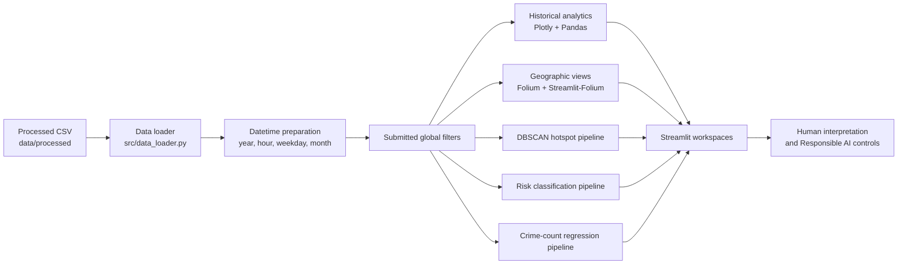

### Architectural layers

| Layer | Location | Responsibility |
|---|---|---|
| Configuration | `config/settings.py` | Existing map, model, threshold, and file settings |
| Data | `data/processed/` | Processed demonstration CSV |
| Data services | `src/data_loader.py` | Cached loading, datetime derivation, filters, filter options |
| ML services | `src/ml_models.py` | DBSCAN, Random Forest utility, Gradient Boosting classifier and regressor |
| Existing charts | `src/visualizations.py` | Original reusable Plotly chart functions |
| Map utilities | `scripts/geo_utils.py` | Folium heatmap and marker-cluster helpers |
| Frontend orchestration | `dashboard/app.py` | Page state, data flow, navigation, error boundaries |
| Frontend components | `dashboard/components/` | Pages, filters, maps, predictions, charts, states, footer |
| Presentation system | `dashboard/styles/` | Design tokens and custom responsive CSS |

## Complete project workflow

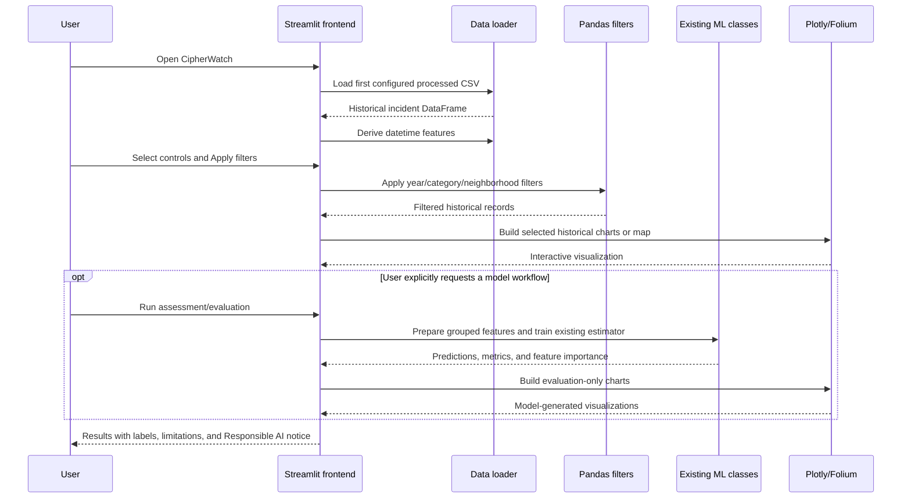

1. Streamlit starts through `dashboard/app.py`.
2. `load_crime_data()` searches `data/processed/` for the configured file names
   in order and loads the first available file.
3. `process_datetime_columns()` parses or creates the datetime field and derives
   `year`, `hour`, `weekday`, and `month`.
4. The sidebar reads available filter values from the loaded dataset.
5. Filter selections remain drafts until **Apply filters** is submitted.
6. `apply_filters()` produces a new filtered DataFrame; it does not alter the
   source DataFrame or CSV.
7. Only the selected workspace is rendered.
8. Historical charts aggregate the filtered rows with Pandas.
9. Folium maps use valid latitude/longitude rows.
10. DBSCAN and predictive pipelines run only in their relevant workspaces.
11. Model workflows require an explicit button action.
12. Results are displayed with provenance labels and human-review warnings.

## Data loading, filtering, and processing

### Loading

`src/data_loader.py` reads the first existing configured file:

1. `data/processed/cleaned_crime.csv`
2. `data/processed/sample_la_crime_2024.csv`

The loader:

- Reads the header first to identify parseable date columns.
- Parses `datetime` or `date` when available.
- Uses Streamlit's data cache with a one-hour TTL.
- Returns an empty DataFrame and UI warning when no configured file exists.

### Datetime preparation

`process_datetime_columns()` derives:

| Field | Meaning |
|---|---|
| `year` | Calendar year from the incident datetime |
| `hour` | Hour from 0 through 23 |
| `weekday` | Full weekday name |
| `month` | Calendar month represented as `YYYY-MM` |

When only separate `date` and `time` fields are available, the function combines
them into `datetime`. The bundled sample already supplies `datetime`.

### Filtering

The current filter form supports:

- One or more years
- One or more crime categories
- One or more neighborhoods
- Arrest status only when the source contains `arrest_made`

The bundled demonstration dataset does not contain `arrest_made`, so the arrest
control is disabled and arrest charts show an explicit unavailable state.

Filtering is deterministic and operates on a copy of the loaded DataFrame.
Model outputs therefore change only when the active filtered rows change; no
source data is rewritten.

## Analytical concepts and boundaries

CipherWatch uses the following terms deliberately:

| Concept | Source | What it means | What it does not mean |
|---|---|---|---|
| Historical incident record | Dataset row | A reported record in the demonstration data | A verified real-time event |
| Observed value | Aggregation of source rows | A count or pattern calculated from historical records | A future forecast |
| Geographic density | Latitude/longitude binning or heatmap | Relative concentration of mapped historical points | A model prediction or individual risk |
| Hotspot cluster | DBSCAN output | A dense group of historical coordinates | A guarantee of future crime |
| Density-derived risk class | Quantile label from grouped historical counts | Training target for Low/Medium/High grouping | Ground truth about a person or community |
| Risk prediction | Gradient Boosting classifier output | Model-generated class for a grouped time-location scenario | Scenario confidence or certainty |
| Predicted crime count | Gradient Boosting regressor output | Estimated grouped historical-pattern count | A guaranteed future incident total |

## Maps, heatmaps, and analytical graphs

All charts use existing rows or existing model outputs. CipherWatch does not
generate synthetic incidents.

### Geographic crime-density heatmap

The **Crime map** uses valid latitude and longitude rows to build a Folium
`HeatMap`. Density is relative to the historical points in the active filter.
The same page includes an interactive binned longitude-latitude density matrix
for detailed hover inspection.

### Day-of-week versus hour heatmap

The **Temporal intelligence** workspace groups historical records by weekday and
hour, fills the seven-by-twenty-four matrix with counts, and orders weekdays from
Monday through Sunday. Each cell is an observed historical count.

### Month versus year heatmap

Records are grouped by calendar year and month. The current demonstration
dataset contains only 2024, so the matrix has one year row and twelve month
columns. It will expand automatically if a future official dataset contains
additional years.

### Neighborhood versus crime-category heatmap

The **Incident analytics** workspace cross-tabulates the most represented
neighborhoods and crime categories. This chart makes source imbalance visible:
the bundled sample is heavily concentrated in one neighborhood.

### Feature-correlation heatmap

The **Model intelligence** workspace calculates Pearson correlation across the
existing regression feature rows and observed grouped count. Correlation is
descriptive; it does not prove causation or fairness.

### Confusion-matrix heatmap

The classifier's held-out target classes form the rows, and its unchanged
held-out predictions form the columns. Diagonal cells represent correct
classification; off-diagonal cells show which classes were confused.

### Other analytical graphs

| Graph | Workspace | Data represented |
|---|---|---|
| Monthly incident trend | Command Center, Incident Analytics, Temporal Intelligence | Observed historical counts |
| Daily bars and seven-day average | Temporal Intelligence | Observed daily records |
| Hourly distribution | Temporal Intelligence | Observed counts by hour |
| Weekday distribution | Temporal Intelligence | Observed counts by weekday |
| Neighborhood comparison | Incident Analytics | Observed counts by neighborhood |
| Crime-category distribution | Command Center, Incident Analytics | Observed counts by category |
| DBSCAN cluster profile | Geographic Hotspots | Existing cluster record counts |
| Risk-level distribution | Predictive Intelligence | Density-derived target classes and predicted classes |
| Predicted versus observed | Predictive Intelligence | Grouped counts and regression estimates |
| Regression residual histogram | Predictive and Model Intelligence | Held-out observed minus predicted counts |
| Feature importance | Model Intelligence | Existing estimator feature importances |
| Train/test performance overview | Model Intelligence | Classifier accuracy and regressor R², separately labeled |

## Hotspot detection

CipherWatch uses the existing `CrimeClusterer` class in `src/ml_models.py`.

### How DBSCAN works here

1. Rows without latitude or longitude are excluded.
2. Latitude and longitude are standardized with `StandardScaler`.
3. DBSCAN measures local density in the standardized coordinate space.
4. A point becomes a core point when enough neighboring points fall within the
   configured radius.
5. Connected core points and nearby border points form a cluster.
6. Points that do not belong to a dense region receive label `-1` and are
   reported as noise.
7. CipherWatch calculates each cluster's center, record count, primary
   neighborhood, density score, and relative concentration band.

Existing configuration:

| Parameter | Value | Purpose |
|---|---:|---|
| `DBSCAN_EPS` | `0.03` | Neighborhood radius in standardized coordinate space |
| `DBSCAN_MIN_SAMPLES` | `10` | Minimum local point count for dense-region formation |
| Minimum mapped records for UI | `50` | Prevents unhelpful very-small clustering views |

Under the default demonstration dataset and settings, the unchanged pipeline
identifies **232 historical clusters** and **1,429 noise records**.

Cluster results describe historical coordinate density only. They are not
individual risk scores, forecasts, patrol instructions, or declarations that a
community is unsafe.

## Risk classification

The active risk workflow uses `TimeLocationRiskClassifier`, backed by
scikit-learn's `GradientBoostingClassifier`.

### Feature preparation

Historical rows are grouped by:

- Hour
- Weekday
- Neighborhood

The grouped row count becomes `incident_count`. Risk targets are derived from
the distribution of that historical count:

- Low: through the 60th percentile
- Medium: above the 60th through the 85th percentile
- High: above the 85th percentile

The model inputs are:

1. Hour
2. Encoded weekday
3. Encoded neighborhood
4. Is night
5. Is evening
6. Is weekend

`incident_count` is deliberately excluded from the classifier inputs because
the risk target is derived from it.

### Training and output

- Estimator: `GradientBoostingClassifier`
- Trees: 100
- Learning rate: 0.1
- Maximum depth: 4
- Random state: 42
- Split: 75% training, 25% held-out test
- Classification split: stratified by risk target
- Output: Low, Medium, or High for a represented grouped scenario

The scenario form encodes a selected neighborhood, weekday, and hour using the
same fitted encoders. The displayed accuracy is a global held-out metric, not
scenario-level probability or confidence.

## Crime-count prediction

The active count workflow uses `CrimeCountPredictor`, backed by scikit-learn's
`GradientBoostingRegressor`.

### Feature preparation

Historical rows are grouped by hour, weekday, and neighborhood. The target is
the grouped `incident_count`.

Inputs:

1. Hour
2. Encoded weekday
3. Encoded neighborhood
4. Historical hour average
5. Historical neighborhood average
6. Is night
7. Is evening
8. Is weekend
9. Is rush hour

### Training and output

- Estimator: `GradientBoostingRegressor`
- Trees: 100
- Learning rate: 0.1
- Maximum depth: 4
- Random state: 42
- Split: 75% training, 25% held-out test
- Output: estimated incident count for a represented grouped feature row

The AI Risk Assessment displays a predicted count only when the exact submitted
scenario has an existing grouped regression feature row. Otherwise it reports
the value as unavailable rather than fabricating an estimate.

## Technology stack

| Technology | Purpose in CipherWatch |
|---|---|
| Python | Application language connecting data loading, feature preparation, models, charts, maps, and Streamlit |
| Streamlit | Interactive dashboard runtime, state management, forms, navigation, caching, metrics, tables, and downloads |
| Pandas | CSV loading, datetime handling, filtering, grouping, pivot tables, cross-tabs, feature rows, and display tables |
| NumPy | Numeric arrays and evaluation-only residual calculations |
| Plotly | Responsive interactive trends, bars, heatmaps, scatter plots, histograms, and model diagnostics |
| Folium | Interactive geographic basemap, heat layers, cluster centers, and incident markers |
| Streamlit-Folium | Embeds Folium maps inside Streamlit and manages map rendering |
| scikit-learn | StandardScaler, DBSCAN, encoders, train/test split, Gradient Boosting, Random Forest utilities, comparison estimators, and metrics |
| Custom CSS | Existing dark cybersecurity design, responsive behavior, focus states, subtle animation, hover treatment, and reduced-motion support |
| LightGBM | Optional model-comparison import in `scripts/model_comparison.py`; not part of the base requirements or active dashboard |
| XGBoost | Optional model-comparison import in `scripts/model_comparison.py`; not part of the base requirements or active dashboard |

### Base Python dependencies

The declared `requirements.txt` contains:

```text
streamlit
pandas
numpy
plotly
folium
streamlit-folium
scikit-learn
```

LightGBM and XGBoost are optional experiments in the comparison script. A normal
CipherWatch installation does not require them.

## Machine-learning algorithms

### DBSCAN

**What it is:** Density-Based Spatial Clustering of Applications with Noise is
an unsupervised clustering algorithm.

**Why it is used:** Crime-coordinate data can form irregularly shaped dense
regions, and the number of regions is not known in advance. DBSCAN can discover
those regions while separating isolated points as noise.

**How it works:** For every point, DBSCAN checks how many neighbors lie within
`eps`. Points meeting `min_samples` become core points. Connected core points and
their border points form clusters. Remaining points receive the noise label.

**Inputs:** Standardized latitude and longitude.

**Outputs:** Integer cluster label per mapped incident; `-1` means noise.

**Advantages:**

- Does not require a predefined number of clusters.
- Finds non-circular cluster shapes.
- Explicitly identifies sparse noise points.

**Limitations:**

- Sensitive to `eps`, `min_samples`, coordinate scaling, and uneven density.
- Does not account for time, category, population, exposure, or reporting bias.
- A cluster is descriptive, not predictive.

**CipherWatch use:** Active **Geographic Hotspots** workspace through
`CrimeClusterer`.

### Random Forest

**What it is:** An ensemble of decision trees trained on varied samples and
feature subsets.

**Why it is used:** Combining many trees can improve robustness and provide
feature-importance estimates.

**How it works:** Each tree learns a sequence of feature splits. Classification
uses a vote across trees; regression averages their numeric outputs.

**Inputs:** Depend on the workflow. The repository's
`NeighborhoodRiskPredictor` prepares average hour, average day of week, average
month, and total incidents by neighborhood. The comparison script uses encoded
time-location features.

**Outputs:** Risk category for classification or numeric count for regression.

**Advantages:**

- Handles non-linear relationships.
- Requires little feature scaling.
- Reduces the instability of one decision tree.
- Reports global feature importance.

**Limitations:**

- Larger ensembles are less directly interpretable.
- Can reproduce historical bias.
- Feature importance does not prove causality.

**CipherWatch use:** Implemented in `NeighborhoodRiskPredictor` and evaluated in
`scripts/model_comparison.py`; it is not the active default dashboard predictor.

### Gradient Boosting Classifier

**What it is:** A supervised ensemble that builds shallow decision trees
sequentially to correct prior classification errors.

**Why it is used:** Time-location relationships are non-linear, and boosting can
model interactions among hour, weekday, neighborhood, and binary time features.

**How it works:** Each new tree focuses on the residual classification error of
the current ensemble. Learning rate controls how strongly each tree contributes.

**Inputs:** Hour, encoded weekday, encoded neighborhood, night flag, evening
flag, and weekend flag.

**Output:** Low, Medium, or High grouped-scenario risk class.

**Advantages:**

- Models non-linear interactions.
- Often performs well on structured tabular data.
- Supplies global feature importance.

**Limitations:**

- Sensitive to depth, learning rate, data volume, and target quality.
- Can overfit small grouped datasets.
- Does not provide causal or individual-level risk.

**CipherWatch use:** Active AI Risk Assessment, Predictive Intelligence, and
Model Intelligence classifier.

### Gradient Boosting Regressor

**What it is:** The numeric-output counterpart of gradient boosting.

**Why it is used:** Grouped incident counts have non-linear relationships with
time, encoded location, and historical average features.

**How it works:** Sequential trees predict and reduce the residual errors left
by the previous ensemble.

**Inputs:** Nine existing time, location, historical-average, and binary timing
features documented above.

**Output:** Estimated grouped incident count.

**Advantages:**

- Captures non-linear relationships.
- Supports feature importance.
- Performs strongly on the current grouped demonstration rows.

**Limitations:**

- Estimates are constrained by patterns represented in training data.
- Small samples and distribution shifts can reduce reliability.
- Negative or out-of-range behavior must be monitored in other datasets.

**CipherWatch use:** Active AI Risk Assessment count context, Predictive
Intelligence regression, and Model Intelligence evaluation.

### Logistic Regression

**What it is:** A linear probabilistic classifier despite its name.

**Why it is used:** It provides a simple, interpretable baseline for risk
classification.

**How it works:** Weighted input features form linear class scores, which are
converted into class probabilities and a final predicted class.

**Inputs:** Encoded time-location and binary timing features in the model
comparison script.

**Output:** Predicted risk class and class probabilities internally.

**Advantages:**

- Fast and comparatively interpretable.
- Useful as a baseline.
- Works well when class boundaries are approximately linear.

**Limitations:**

- Cannot naturally capture complex non-linear relationships without engineered
  interactions.
- Sensitive to feature scaling and correlated inputs.

**CipherWatch use:** Optional comparison model in
`scripts/model_comparison.py`; not used by the live dashboard.

### Decision Tree

**What it is:** A supervised model that recursively splits data into regions
using feature thresholds.

**Why it is used:** It creates an understandable baseline for classification and
regression.

**How it works:** At each node, the algorithm selects a split that improves
class purity or reduces numeric error. A leaf returns a class or value.

**Inputs:** Encoded time-location and binary timing features in the comparison
script.

**Outputs:** Risk class for classification or incident-count estimate for
regression.

**Advantages:**

- Easy to explain visually.
- Captures non-linear rules.
- Requires little preprocessing.

**Limitations:**

- A single tree can overfit and change substantially with small data changes.
- Deep trees generalize poorly without constraints.

**CipherWatch use:** Optional classifier and regressor in
`scripts/model_comparison.py`; not used by the live dashboard.

### LightGBM

**What it is:** A high-performance gradient-boosted tree library that grows
trees leaf-wise.

**Why it is considered:** It can train efficiently on large tabular datasets and
often provides strong predictive performance.

**How it works:** Each boosting round adds a tree that reduces current errors;
histogram-based feature binning improves speed and memory efficiency.

**Inputs:** Encoded time-location and binary timing features prepared by the
comparison script.

**Outputs:** Risk class or numeric incident-count estimate.

**Advantages:**

- Fast and memory-efficient on large datasets.
- Handles complex non-linear relationships.
- Supports classification, regression, and feature importance.

**Limitations:**

- Can overfit small datasets.
- Requires careful hyperparameter control.
- Adds an optional external dependency.

**CipherWatch use:** Optional guarded import in `scripts/model_comparison.py`.
It is not declared in `requirements.txt`, not used by the live dashboard, and no
LightGBM result should be assumed unless the script is run in an environment
where the package is installed.

### XGBoost

**What it is:** A regularized gradient-boosted tree library optimized for
structured data.

**Why it is considered:** It is a widely used benchmark for tabular
classification and regression.

**How it works:** Trees are added sequentially to reduce a regularized objective
that combines prediction error and model complexity.

**Inputs:** Encoded time-location and binary timing features prepared by the
comparison script.

**Outputs:** Risk class or numeric incident-count estimate.

**Advantages:**

- Strong tabular-data performance.
- Built-in regularization.
- Handles non-linear feature interactions.

**Limitations:**

- Can be computationally heavier than simpler baselines.
- Hyperparameters materially affect generalization.
- Adds an optional external dependency.

**CipherWatch use:** Optional guarded import in `scripts/model_comparison.py`.
It is not declared in `requirements.txt` and is not used by the live dashboard.

## Model inputs and outputs

### Active classifier

| Type | Values |
|---|---|
| Input unit | One grouped hour-weekday-neighborhood scenario |
| Features | Hour, weekday encoding, neighborhood encoding, night, evening, weekend |
| Target | Historical count-quantile class |
| Output | Model-generated Low, Medium, or High |
| Evaluation rows | Held-out 25% of 173 grouped scenarios |

### Active regressor

| Type | Values |
|---|---|
| Input unit | One grouped hour-weekday-neighborhood scenario |
| Features | Hour, weekday encoding, neighborhood encoding, hour average, neighborhood average, night, evening, weekend, rush hour |
| Target | Observed grouped incident count |
| Output | Model-generated numeric grouped count |
| Evaluation rows | Held-out 25% of 173 grouped scenarios |

## Evaluation metrics

### Accuracy

The share of held-out classification rows whose predicted class matches the
target class:

`correct predictions / all predictions`

Accuracy is easy to understand but can hide poor performance on minority
classes.

### Precision

For a class, precision asks: of the rows predicted as this class, how many were
actually this class?

`true positives / (true positives + false positives)`

High precision means fewer false alarms for that class.

### Recall

For a class, recall asks: of the rows actually belonging to this class, how many
did the model identify?

`true positives / (true positives + false negatives)`

High recall means fewer missed examples.

### F1 score

F1 is the harmonic mean of precision and recall:

`2 × precision × recall / (precision + recall)`

It is useful when both false positives and false negatives matter. CipherWatch
reports weighted precision, recall, and F1 across risk classes.

### R²

The coefficient of determination measures how much held-out target variance is
explained by a regression model.

- `1.0`: perfect agreement
- `0.0`: no improvement over predicting the target mean
- Below `0.0`: worse than that mean baseline

R² is not an error in incident-count units.

### MAE

Mean Absolute Error is the average absolute difference between observed and
predicted counts:

`mean(|observed - predicted|)`

It is expressed in the same units as the target and is comparatively resistant
to a few very large errors.

### RMSE

Root Mean Squared Error is the square root of the mean squared error:

`sqrt(mean((observed - predicted)²))`

Because errors are squared, RMSE penalizes large misses more strongly than MAE.

### Confusion matrix

A confusion matrix counts classification outcomes by actual and predicted class.
Rows are actual density-derived target classes; columns are model predictions.
The diagonal shows correct classifications, while off-diagonal cells expose
specific class confusion.

### Feature importance

Tree-based feature importance summarizes how much each feature contributed to
split improvements across the fitted ensemble. It is global, not specific to
one scenario. Importance does not establish causation, fairness, or a direction
of effect.

## Current demonstration results

These results are produced by the existing models, features, parameters, and
random split on the bundled 9,701-row sample.

### Risk classifier

| Metric | Result |
|---|---:|
| Grouped scenarios | 173 |
| Training accuracy | 100.0% |
| Held-out accuracy | 47.7% |
| Weighted precision | 44.8% |
| Weighted recall | 47.7% |
| Weighted F1 | 46.2% |

Held-out confusion matrix:

| Actual \ Predicted | Low | Medium | High |
|---|---:|---:|---:|
| Low | 20 | 5 | 2 |
| Medium | 7 | 1 | 3 |
| High | 2 | 4 | 0 |

The large training/test gap and zero correctly classified High rows in this
particular held-out split demonstrate why these predictions must not be treated
as operational certainty.

### Crime-count regressor

| Metric | Result |
|---|---:|
| Grouped scenarios | 173 |
| Training R² | 0.976 |
| Held-out R² | 0.820 |
| Training MAE | 2.66 |
| Held-out MAE | 8.03 |
| Held-out RMSE | 9.98 |

Metrics are evaluation results for the current demonstration split. They do not
guarantee performance on future, live, or Karnataka-specific data.

## Dataset information

Current bundled dataset:

| Attribute | Value |
|---|---|
| File | `data/processed/sample_la_crime_2024.csv` |
| Source context | City of Los Angeles Open Data demonstration sample |
| Records | 9,701 |
| Date range | 1 January 2024 to 15 December 2024 |
| Years represented | 2024 |
| Neighborhood labels | 5 |
| Crime categories | 83 |
| Source columns | `datetime`, `crime_type`, `neighborhood`, `latitude`, `longitude` |
| Arrest status | Not supplied |
| Live updates | None |

The sample is geographically and categorically imbalanced. It should be used to
demonstrate software and analytical workflows, not to make claims about
Karnataka, Los Angeles communities, or future public-safety conditions.

## Dashboard workspaces

### Command Center

High-level project identity, eight KPIs, monthly trend, top crime categories,
historical geographic heatmap preview, and Responsible AI notice.

### Crime Map

Combined, Heatmap, and Incident Clusters modes; selected-area historical
intelligence; layer explanations; interactive density matrix.

### Incident Analytics

Monthly trend, top categories, neighborhood comparison, arrest-status
availability, neighborhood/category heatmap, and searchable incident register.

### Temporal Intelligence

Peak observed hour/day, hourly and weekday distributions, weekday/hour heatmap,
month/year heatmap, daily trend with seven-day moving average, and monthly
trend.

### Geographic Hotspots

Existing DBSCAN metrics, center map, cluster interpretation, cluster-volume
profile, noise count, and detailed cluster register.

### AI Risk Assessment

Explicit scenario form for represented neighborhood, weekday, and hour. Displays
model-generated risk, observed grouped baseline, optional predicted count,
global feature factors, held-out accuracy context, and Responsible AI warning.

### Predictive Intelligence

Three on-demand modes:

- Risk classification and risk-level distribution
- Crime-count regression, observed/predicted comparison, and residuals
- Model-generated weekday/hour high-risk matrix

### Model Intelligence

Train/test overview, classification metrics, confusion matrix, regression
metrics, feature importance, feature correlation, residuals, and a metric guide.

### System Information

Dataset provenance, loaded fields, analytical capabilities, source limitations,
interpretation boundaries, and Responsible AI protocol.

## Project structure

```text
city-crime/
├── config/
│   └── settings.py                    # Existing app and model settings
├── dashboard/
│   ├── app.py                         # Streamlit entry point
│   ├── components/
│   │   ├── analytical_charts.py       # Frontend-only heatmaps and diagnostics
│   │   ├── chart_containers.py        # Shared Plotly panel styling
│   │   ├── filters.py                 # Form-batched global controls
│   │   ├── footer.py                  # Status and filtered export
│   │   ├── header.py                  # Top telemetry and page headings
│   │   ├── info_boxes.py              # Informational callouts
│   │   ├── kpi_cards.py               # KPI and area summaries
│   │   ├── map_view.py                # Folium and hotspot workspaces
│   │   ├── pages.py                   # Historical/system page compositions
│   │   ├── predictions.py             # Prediction and model UI workflows
│   │   ├── sidebar.py                 # Navigation and telemetry
│   │   └── states.py                  # Loading, empty, error, ethics states
│   └── styles/
│       ├── custom_css.py               # Responsive cybersecurity presentation
│       └── design_tokens.py            # Colors, titles, version
├── data/
│   ├── README.md
│   └── processed/
│       └── sample_la_crime_2024.csv    # Demonstration dataset
├── docs/                               # Supplementary project documentation
├── screenshots/                        # Current README screenshots
├── scripts/
│   ├── clean_data.py                   # Data utility
│   ├── download_sample_data.py         # Demonstration-data utility
│   ├── fetch_la_data.py                # LA data utility
│   ├── geo_utils.py                    # Folium heatmap/marker helpers
│   └── model_comparison.py             # Optional comparison experiment
├── src/
│   ├── data_loader.py                  # Loading, datetime preparation, filters
│   ├── ml_models.py                    # Existing ML classes
│   └── visualizations.py               # Existing chart functions
├── requirements.txt
├── LICENSE
└── README.md
```

## Installation and run instructions

### Prerequisites

- Python 3.10 or newer recommended
- Git
- A modern browser

### Windows PowerShell

```powershell
git clone https://github.com/mouryas-aiml/CipherWatch-KSP.git
cd CipherWatch-KSP

python -m venv .venv
.\.venv\Scripts\Activate.ps1

python -m pip install --upgrade pip
pip install -r requirements.txt

streamlit run .\dashboard\app.py
```

### macOS or Linux

```bash
git clone https://github.com/mouryas-aiml/CipherWatch-KSP.git
cd CipherWatch-KSP

python3 -m venv .venv
source .venv/bin/activate

python -m pip install --upgrade pip
pip install -r requirements.txt

streamlit run dashboard/app.py
```

Open [http://localhost:8501](http://localhost:8501) if Streamlit does not open
the dashboard automatically.

### Optional model comparison

```powershell
python .\scripts\model_comparison.py
```

The comparison script attempts Random Forest, Gradient Boosting, Logistic
Regression, Decision Tree, and optional LightGBM/XGBoost models. Optional models
are skipped when their packages are not installed. Its experiment is separate
from the active dashboard pipelines.

## Testing and validation

### Frontend syntax validation

This command parses every dashboard Python file without creating bytecode:

```powershell
python -B -c "import ast, pathlib; files=list(pathlib.Path('dashboard').rglob('*.py')); [ast.parse(p.read_text(encoding='utf-8')) for p in files]; print(f'AST OK: {len(files)} files')"
```

### Data-loader smoke test

```powershell
python -B -c "from src.data_loader import load_crime_data, process_datetime_columns; df=process_datetime_columns(load_crime_data()); print(df.shape, df.datetime.min(), df.datetime.max())"
```

Expected with the bundled sample:

```text
(9701, ...) 2024-01-01 00:01:00 2024-12-15 13:00:00
```

### Model smoke test

```powershell
python -B -c "from src.data_loader import load_crime_data, process_datetime_columns; from dashboard.components.predictions import run_risk_pipeline, run_count_pipeline; df=process_datetime_columns(load_crime_data()); print(run_risk_pipeline(df)['test_accuracy']); print(run_count_pipeline(df)['test_r2'])"
```

### Repository checks

```powershell
git diff --check
git status --short
```

### Application health

While the app is running:

```powershell
(Invoke-WebRequest http://localhost:8501/_stcore/health).Content
```

Expected response:

```text
ok
```

### Manual QA checklist

- Open all nine workspaces.
- Apply, reset, and clear global filters.
- Verify filtered KPIs and table counts.
- Test all three map modes.
- Hover and zoom every Plotly heatmap.
- Run the DBSCAN workspace.
- Execute an AI risk scenario.
- Run each Predictive Intelligence mode.
- Run Model Intelligence evaluation.
- Download filtered historical records.
- Confirm empty states with restrictive filters.
- Test keyboard focus and sidebar navigation.
- Test desktop and tablet widths for horizontal overflow.
- Verify source and Responsible AI disclosures.

## Performance and accessibility

### Performance

- Source loading remains cached by the existing data loader.
- Filters are batched in a Streamlit form.
- Only the selected workspace renders.
- Model and DBSCAN outputs use bounded frontend caches.
- Prediction and evaluation workflows require explicit actions.
- The Command Center uses a lightweight heatmap-only preview.
- Map point sampling is deterministic when the existing maximum is exceeded.
- Large display tables are bounded while showing the full record count.
- Animations use lightweight CSS transforms, opacity, borders, and shadows.

### Accessibility

- High-contrast dark palette
- Visible keyboard focus
- Semantic headings and labels
- Text and symbol cues in addition to color
- Responsive control and metric wrapping
- Descriptive chart captions and legends
- Reduced-motion media query
- No rapid flashing, glitch effects, or background videos
- No raw stack trace unless Developer diagnostics is opened
- Responsible AI notices in predictive contexts

## Limitations

1. The bundled data is a demonstration LA sample, not operational Karnataka data.
2. The sample contains 9,701 rows and only one year, which limits temporal
   generalization.
3. Neighborhood coverage is highly imbalanced.
4. Arrest status is absent.
5. Models train on 173 grouped scenarios, a small evaluation base.
6. The current classifier's held-out accuracy is 47.7%, with a substantial
   training/test gap.
7. Risk targets are historical count quantiles, not validated operational harm
   labels.
8. DBSCAN uses latitude and longitude only; it does not incorporate time,
   category, population, reporting exposure, or causal context.
9. Predicted counts apply only to represented grouped feature rows.
10. Feature importance and correlation do not establish causality.
11. Historical reporting and enforcement practices can create bias.
12. The project has no live API, official police integration, authentication,
    case-management connection, or real-time alerting.
13. Visual QA cannot represent every browser, device, or assistive technology.

## Responsible AI notice

> [!WARNING]
> CipherWatch model predictions are statistical estimates based on historical
> reported-crime data. They may reflect reporting patterns, data-quality issues,
> geographic imbalance, demographic bias, and historical enforcement practices.
> Predictions are not guaranteed future events and must not be used as the sole
> basis for enforcement, detention, surveillance, patrol allocation, or any
> decision affecting an individual or community. Qualified human review,
> documented policy, legal authority, fairness assessment, and independent
> validation are required before any operational use.

CipherWatch does not predict whether an individual will commit a crime. Its
active models operate on grouped hour-weekday-neighborhood patterns in a
demonstration dataset.

## Future enhancements

- Replace the demonstration sample with an officially governed dataset after
  documented authorization and privacy review.
- Add secure authentication and role-based access for an official deployment.
- Add dataset versioning, lineage, schema validation, and audit logs.
- Introduce time-aware validation instead of relying only on a random split.
- Add calibration and per-class recall monitoring.
- Add fairness, drift, coverage, and missing-data diagnostics.
- Add interpretable scenario-level explanations after independent validation.
- Add official geographic boundary layers where licensing permits.
- Add automated unit, integration, accessibility, and visual-regression tests.
- Add privacy-preserving aggregation for low-count cells.
- Add model cards, data sheets, approval workflows, and documented rollback.
- Evaluate forecasting only when multiple complete years of governed data exist.

## Screenshots

All screenshots below come from the current CipherWatch frontend and the bundled
demonstration dataset.

### Command Center


### Crime Map

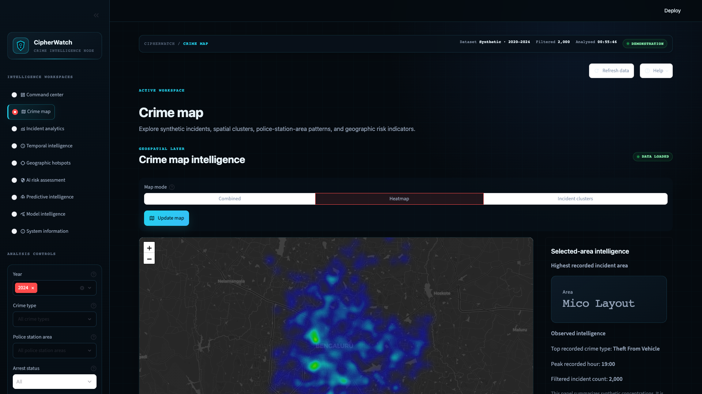

### Incident Analytics

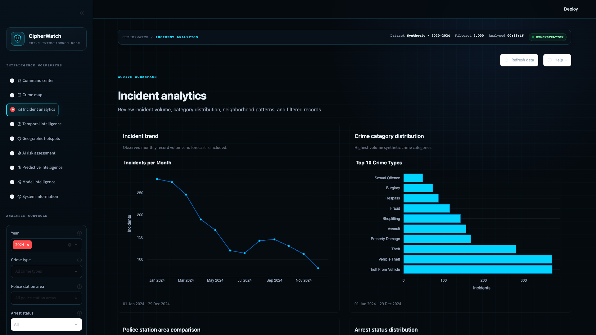

### Temporal Intelligence

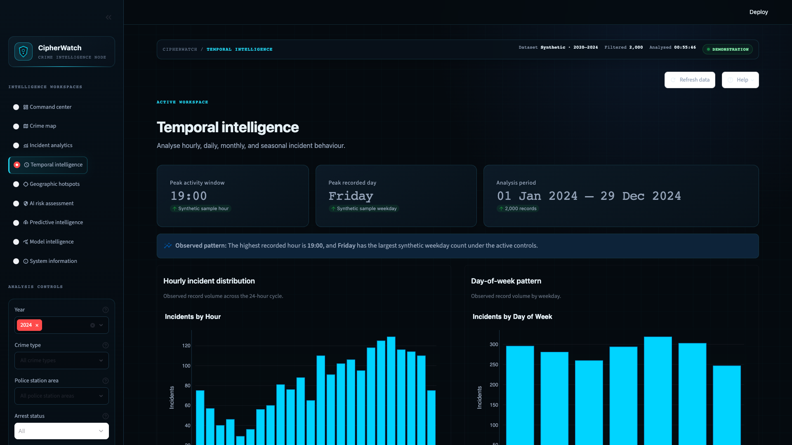

### Geographic Hotspots

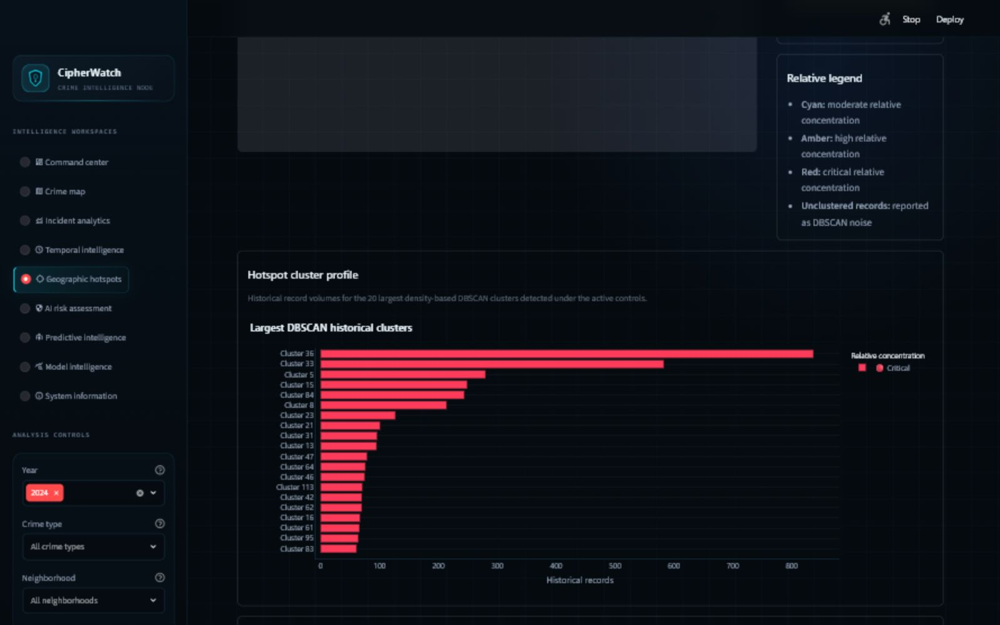

### AI Risk Assessment

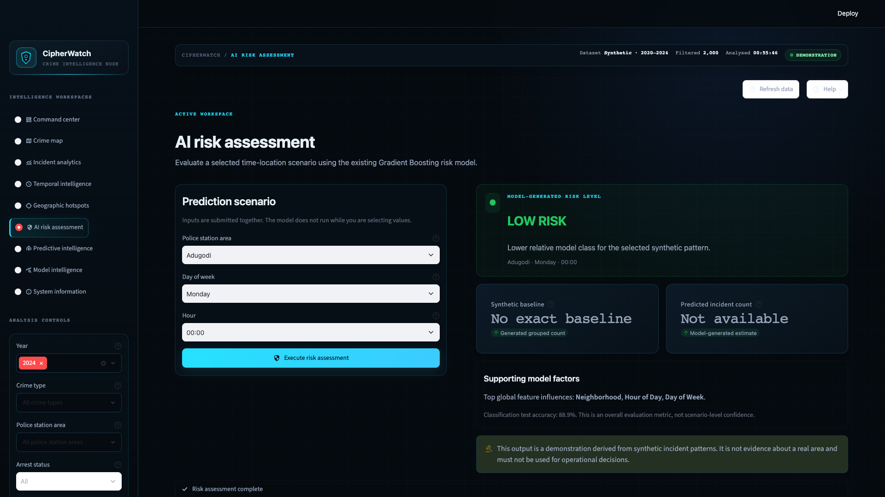

### Predictive Intelligence

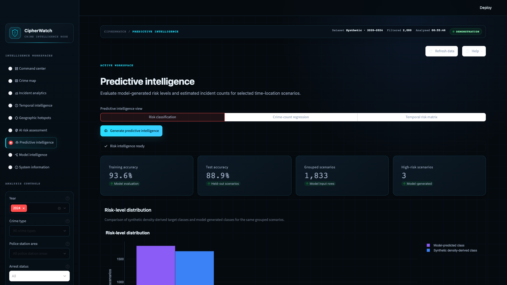

### Model Intelligence

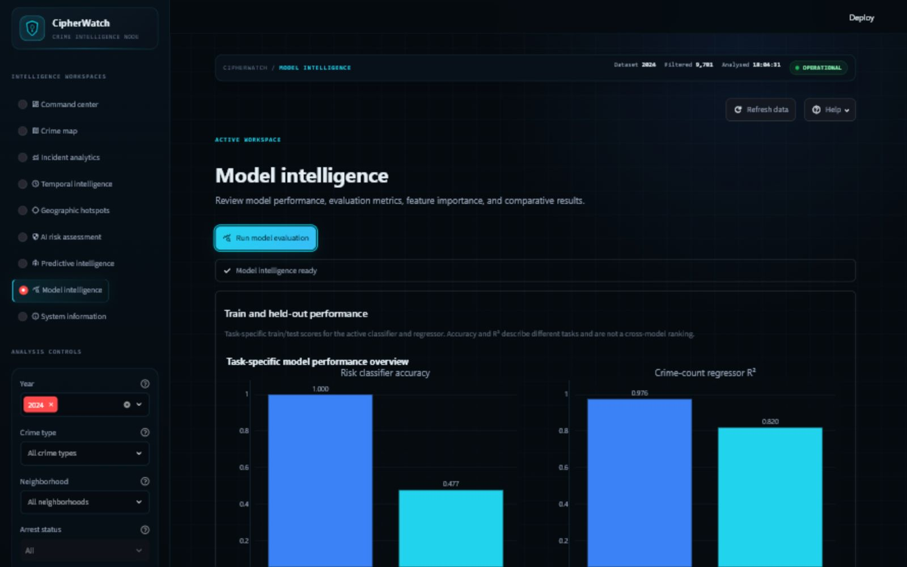

### System Information

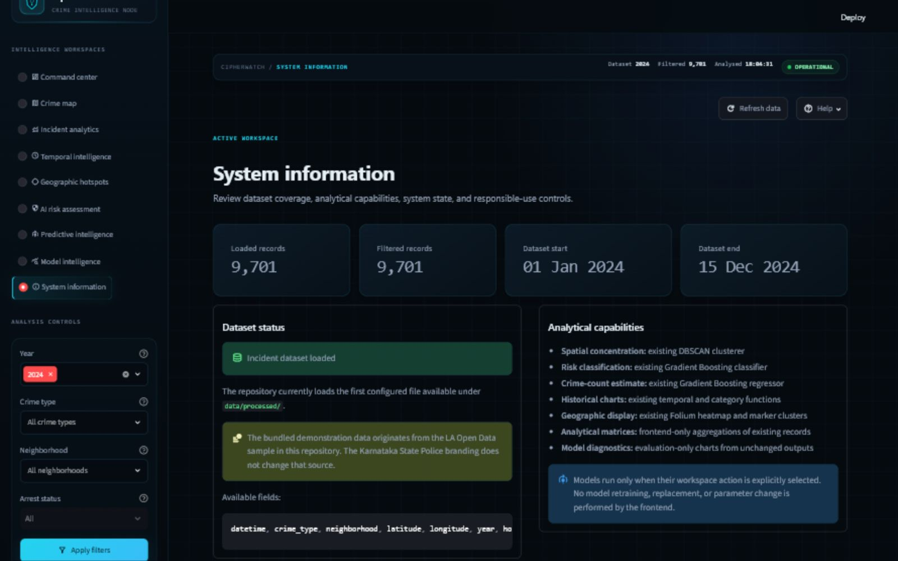

## License

This project is licensed under the MIT License. See [LICENSE](LICENSE).

## Acknowledgments

- City of Los Angeles Open Data for the demonstration-data context
- Streamlit, Pandas, NumPy, Plotly, Folium, Streamlit-Folium, and scikit-learn
- Open-source contributors supporting reproducible and responsible data science
